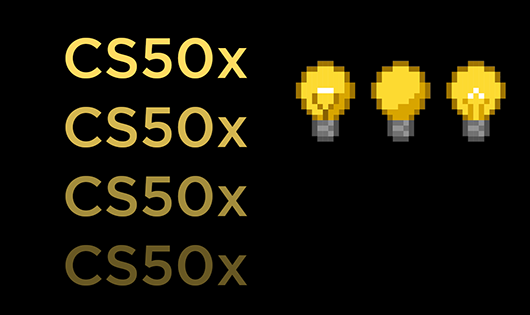

# 🎓 CS50x — Harvard Computer Science Journey

Welcome to my **CS50x Harvard repository**, where I document my structured journey through computer science, programming, and software development.

This repository includes weekly problem sets, projects, and hands-on coding exercises covering fundamental to advanced topics.

## 📸 Preview

## 📂 Weekly Structure

🟡 Week 1 — C  
🔴 Week 2 — Arrays  
🟣 Week 3 — Algorithms  
⚫ Week 4 — Memory  
🟤 Week 5 — Data Structures  
🟢 Week 6 — Python  
🌐 Week 7 — SQL  
💻 Week 8 — HTML / CSS / JavaScript  
🚀 Week 9 — Flask  
🏆 Week 10 — Final Project  

## 🧠 About This Repository

This repository represents my complete learning journey through Harvard CS50x, focusing on:

- Computational thinking and problem solving  
- Low-level programming (C language)  
- Data structures and algorithms  
- Memory management  
- Python programming  
- Databases and SQL  
- Web development (frontend + backend)  
- Full-stack development with Flask  

## 🛠️ Technologies Used

### Core Programming

### Web Development

### Backend & Tools

## 🎯 Goals of This Repository

- Master CS fundamentals from Harvard CS50x  
- Build strong problem-solving skills  
- Learn full-stack web development  
- Strengthen Git & GitHub workflow  
- Build a strong scholarship-level portfolio (GKS / Japan / etc.)

## 📚 Learning Source

- Harvard CS50x — Introduction to Computer Science

## 🚀 Progress Tracker

- [x] Week 0 — Scratch & Basics  
- [ ] Week 1 — C  
- [ ] Week 2 — Arrays  
- [ ] Week 3 — Algorithms  
- [ ] Week 4 — Memory  
- [ ] Week 5 — Data Structures  
- [ ] Week 6 — Python  
- [ ] Week 7 — SQL  
- [ ] Week 8 — Web Development  
- [ ] Week 9 — Flask  
- [ ] [ ] Week 10 — Final Project  

## 📌 Author

**Nazanin Khalesi**  
Computer Science Student | Aspiring Software Engineer | Future Full-Stack Developer  

## ⭐ Note

This repository is continuously updated as I progress through Harvard CS50x.